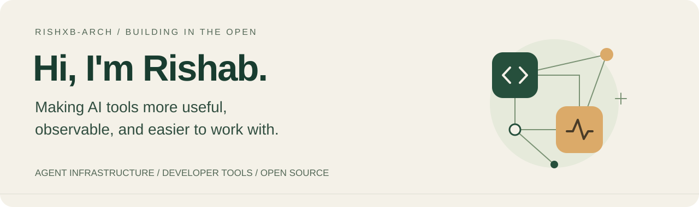

### Welcome — glad you're here 👋

I build tools around AI agents and the people working with them: local workspaces, agent identity, and ways to understand what an LLM application is actually doing. I also test open-source AI projects, turn rough edges into reproducible bug reports, and contribute fixes upstream.

[Explore my projects](https://github.com/Rishxb-arch?tab=repositories) · [Read my field notes](https://github.com/Rishxb-arch/oss-field-notes) · [See my contributions](https://github.com/pulls?q=is%3Apr+author%3ARishxb-arch+is%3Amerged)

## A few things I'm building

<table>
<tr>
<td width="50%" valign="top">
<h3><a href="https://github.com/Rishxb-arch/model-complier">mcomp ↗</a></h3>

<b>One workspace for your coding agents.</b>

A local UI for Claude Code, Codex, and Cursor CLIs, with live terminals and a cross-model task graph.

TypeScript · React · Node.js · Tauri

</td>
<td width="50%" valign="top">
<h3><a href="https://github.com/Rishxb-arch/truthspan">Truthspan ↗</a></h3>

<b>Understand your LLM application's behavior.</b>

OpenTelemetry-compatible tracing alongside quality metrics for grounding, hallucination, and correctness.

Python · OpenTelemetry · React

</td>
</tr>
<tr>
<td width="50%" valign="top">
<h3><a href="https://github.com/Rishxb-arch/AgentPass">AgentPass ↗</a></h3>

<b>An identity layer for AI agents.</b>

Signed agent passports, scoped delegation, and audit trails, with an SDK and operations dashboard.

TypeScript · Fastify · Next.js · PostgreSQL

</td>
<td width="50%" valign="top">
<h3><a href="https://github.com/Rishxb-arch/northstar-studio">Northstar Studio ↗</a></h3>

<b>A workspace for the creative process.</b>

A creator-ops beta for turning positioning and ideas into production briefs, weekly plans, and a content calendar.

TypeScript · Creator tools · Product design

</td>
</tr>
</table>

## Open source, hands on

I like getting a project running, investigating where it breaks, and leaving behind something another developer can reproduce.

A few merged contributions:

- **[Dograh · clearer service errors](https://github.com/dograh-hq/dograh/pull/851)** — return a clear 503 when the hosted service is unreachable during template workflows.
- **[Lalamo · CPU batching](https://github.com/trymirai/lalamo/pull/375)** — add a `--batch-size` option for the model server.
- **[Dograh · safer quickstart documentation](https://github.com/dograh-hq/dograh/pull/850)** — explain the public tunnel and open signup behavior.

For testing notes, reproduction scripts, and investigations across voice AI, inference, and agent tooling, start with **[OSS Field Notes →](https://github.com/Rishxb-arch/oss-field-notes)**.

## What I work with

**Languages** · TypeScript, Python, JavaScript  
**Applications** · React, Next.js, Node.js, Fastify  
**Infrastructure** · PostgreSQL, Docker, OpenTelemetry  
**Interests** · Agent workflows, LLM observability, developer experience, reproducible testing

---

### Let's build something useful

Trying one of these projects? I'd love to hear what worked, what broke, or what you wish it did. **Open an issue in the relevant repository** — a small reproduction or a thoughtful idea is a great place to start.
